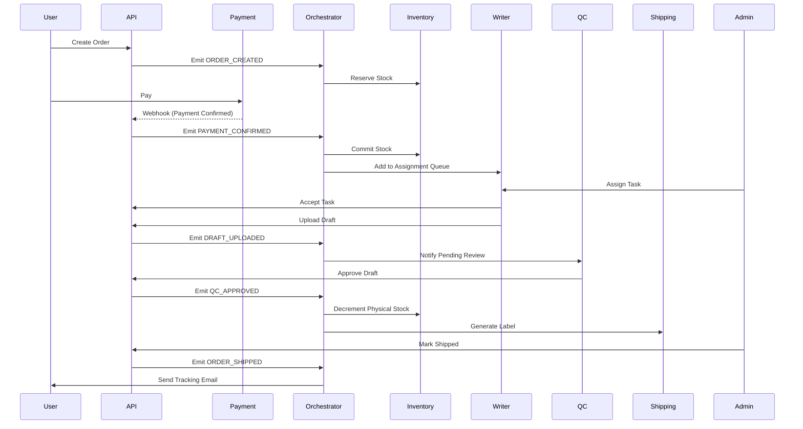

# System Orchestration & Integration

## Sequence Diagram (Order Lifecycle)



## Deployment & Scaling Notes

### Worker Processes
For heavy tasks triggered by the Orchestrator (e.g., Image Processing, Bulk Emailing, CSV Exports), use a separate worker process or serverless functions (e.g., AWS Lambda / Cloudflare Workers) subscribed to a message queue (Redis/RabbitMQ).

### Ephemeral Queues
Use Redis for:
- Job Queues (BullMQ)
- Idempotency Keys (TTL 24h)
- Caching Inventory Counts

### Monitoring
- **Sentry**: For error tracking in Orchestrator and API.
- **Prometheus/Grafana**: Monitor event throughput (Orders/min, Webhooks/min).
- **Alerts**: Low stock, Payment webhook failures, High QC rejection rate.

## Rollback Strategies

1.  **Payment Confirmed but Stock Missing**:
    - **Action**: Trigger `CRITICAL_ALERT` to Admin.
    - **Compensation**: Auto-refund or offer backorder option to customer. Do not fail the webhook (return 200 OK) but log the inconsistency.

2.  **QC Repeated Rejections**:
    - **Action**: If rejection count > 3, flag order for `SUPER_ADMIN_REVIEW`.
    - **Compensation**: Pause writer assignment for that user.

## Configuration (Env Vars)

```env
# Core
MONGODB_URI=mongodb+srv://...
JWT_SECRET=...
NODE_ENV=production

# Payments
RAZORPAY_KEY_ID=...
RAZORPAY_KEY_SECRET=...
RAZORPAY_WEBHOOK_SECRET=...

# Storage
CLOUDFLARE_ACCOUNT_ID=...
CLOUDFLARE_API_TOKEN=...

# Notifications
SMTP_HOST=...
TWILIO_SID=...
WHATSAPP_API_KEY=...

# Orchestration
REDIS_URL=redis://...
EVENT_BUS_MODE=memory # or 'redis' for distributed
```
